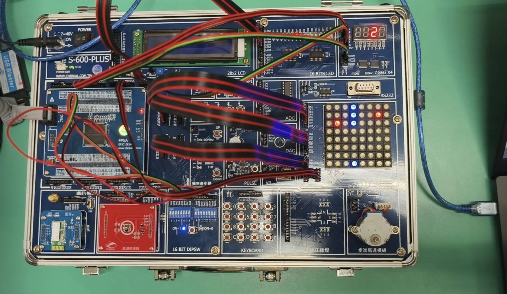
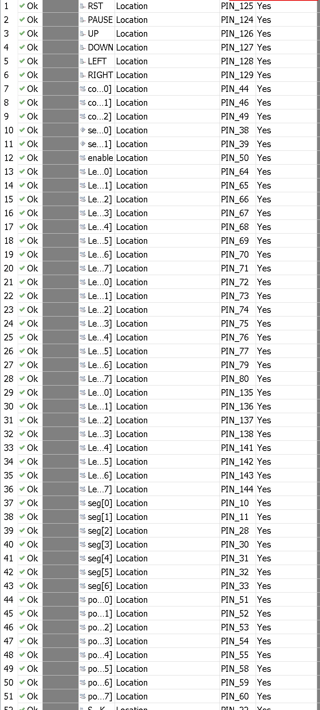

# Snake Game on FPGA

這是一個基於 FPGA 的貪吃蛇遊戲，使用 Verilog HDL 實現。遊戲在 8x8 LED 矩陣上顯示，並使用按鈕控制蛇的移動。
* 整體介面，使用8 DIPSW來控制方向，暫停的選項是SW15開關
* 
## 前言
組別: ` 20 `<br>
組員:
```
112321063
112321065

```
## 功能

- **遊戲開始/重置**：按下 RST 按鈕重置遊戲。
- **暫停**：按下 PAUSE 按鈕暫停遊戲。
- **移動控制**：使用 `UP`、`DOWN`、`LEFT`、`RIGHT` 按鈕控制蛇的移動方向。
- **得分顯示**：使用七段顯示器顯示當前得分。
- **雙食物**：遊戲中同時存在兩個食物，蛇吃到食物後得分增加，並在地圖上生成新的食物。

## Pin腳位

`使用EP3C10E144C8`
`Cyclone iii`

### 輸入

- `SYS_CLK`：系統時鐘信號。
- `RST`：重置信號，重置遊戲。
- `PAUSE`：暫停信號，暫停遊戲。
- `UP`、`DOWN`、`LEFT`、`RIGHT`：控制蛇移動方向的信號。

### 輸出

- `LedR`、`LedG`、`LedB`：控制 8x8 LED 矩陣的紅、綠、藍顏色。
- `comm`：LED 矩陣掃描控制信號。
- `enable`：使能信號。
- `point`：當前得分。
- `seg`：七段顯示器的數字顯示。
- `an`：七段顯示器的位選信號。

## 遊戲邏輯

- **初始化**：在遊戲開始時，蛇和食物的位置被初始化。
- **移動邏輯**：根據按鈕輸入更新蛇的移動方向，並計算下一個位置。
- **碰撞檢測**：檢查蛇是否吃到食物或撞到邊界。
- **得分更新**：當蛇吃到食物時，得分增加，並在地圖上生成新的食物。

## 參考:
* https://github.com/vale5230/Snake-Game-in-FPGA/blob/master/README.md
